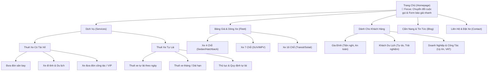

# Kiến Trúc Thông Tin & Sitemap Website Dịch Vụ Xe - Nhà Xe Thanh Tuấn

Tài liệu này phác thảo kiến trúc thông tin (Information Architecture - IA) và sơ đồ trang (Sitemap) cho dự án website **Nhà Xe Thanh Tuấn**. Thiết kế tập trung vào việc đáp ứng nhu cầu của 3 nhóm khách hàng trọng tâm (Gia đình, Khách du lịch, Khách công tác/Doanh nghiệp) nhằm tối ưu hóa tỷ lệ chuyển đổi cuộc gọi trực tiếp (Hotline) và đăng ký tư vấn (Leads).

---

## 1. Sơ Đồ Trang (Sitemap)

Sơ đồ dưới đây thể hiện luồng liên kết và phân cấp trang web từ Trang chủ đến các dịch vụ và phân khúc khách hàng mục tiêu.

---

## 2. Cấu Trúc Điều Hướng (Navigation Structure)

Để tối ưu trải nghiệm và dẫn dắt người dùng đến mục tiêu gọi điện hoặc điền form nhanh chóng, hệ thống điều hướng được thiết kế như sau:

### 2.1. Thanh Điều Hướng Chính (Header / Global Navigation)
*   **Logo**: Nhà Xe Thanh Tuấn (Bấm về Trang chủ).
*   **Menu Dịch Vụ (Dropdown)**:
    *   Thuê xe có tài xế.
    *   Thuê xe tự lái.
*   **Menu Bảng Giá & Xe (Dropdown / Link)**:
    *   Xe 4 Chỗ | Xe 7 Chỗ | Xe 16 Chỗ.
*   **Góc Khách Hàng (Dropdown)**:
    *   Dịch vụ cho Gia Đình.
    *   Cẩm nang Du Lịch.
    *   Giải pháp cho Doanh Nghiệp.
*   **Tin Tức / Blog**: Cẩm nang đi lại, kinh nghiệm lái xe.
*   **Liên Hệ**: Trang thông tin liên hệ và bản đồ.
*   **Nút CTA Nổi Bật (Màu cam/đỏ tương phản)**: **"Đặt Xe Ngay - [Hotline]"** hoặc **"Báo Giá Nhanh"**.

### 2.2. Thanh Tiện Ích Di Động Sticky (Mobile Sticky Bar)
Với 80%+ lưu lượng truy cập dịch vụ vận tải đến từ thiết bị di động, thanh sticky dưới cùng màn hình điện thoại là cực kỳ quan trọng:
1.  **Nút Gọi Ngay (Call Now)**: Kích hoạt cuộc gọi trực tiếp đến Hotline (Chiếm diện tích lớn nhất, màu đỏ/cam nổi bật).
2.  **Nút Chat Zalo**: Kết nối nhanh với nhân viên hỗ trợ để gửi ảnh xe, báo giá chi tiết qua Zalo chat.
3.  **Nút Nhận Báo Giá**: Link nhanh tới form điền thông tin nhu cầu đặt xe.

### 2.3. Menu Chân Trang (Footer Navigation)
*   **Cột 1: Thông tin công ty**: Tên nhà xe, mã số thuế, địa chỉ văn phòng, giấy phép kinh doanh vận tải.
*   **Cột 2: Dịch vụ**: Thuê xe có lái, thuê xe tự lái, đưa đón sân bay, xe đi tỉnh.
*   **Cột 3: Hỗ trợ khách hàng**: Hướng dẫn đặt xe, Thủ tục thuê xe tự lái, Chính sách hoàn hủy/bồi thường, Phương thức thanh toán.
*   **Cột 4: Kết nối**: Bản đồ Google Maps nhúng, icon mạng xã hội (Facebook, Zalo, Youtube) và chứng nhận Bộ Công Thương.

---

## 3. Hệ Thống Cấp Bậc Nội Dung (Page Hierarchy)

Thiết kế chi tiết cấu trúc nội dung từ trên xuống dưới cho các trang quan trọng nhất nhằm tối ưu hóa chuyển đổi (Conversion-Focused Design).

### 3.1. Trang Chủ (Homepage)

> [!IMPORTANT]
> Mục tiêu trang chủ là định vị thương hiệu ngay lập tức, phân loại nhu cầu khách hàng và thúc đẩy hành động liên hệ nhanh qua hotline/Zalo.

1.  **Hero Section (Khu vực đầu trang)**:
    *   *Tiêu đề chính (H1)*: "Dịch Vụ Cho Thuê Xe Uy Tín Tại [Tên Địa Phương] - Có Lái & Tự Lái Giá Tốt Nhất".
    *   *Hình ảnh*: Ảnh thực tế dàn xe đời mới của Thanh Tuấn sạch sẽ, sang trọng.
    *   *Widget Đặt Xe Nhanh (Booking Widget)*: Form đơn giản lựa chọn: Loại dịch vụ (Có lái / Tự lái), Điểm đi, Điểm đến, Ngày giờ đi, Số điện thoại liên hệ.
    *   *CTA chính*: Nút "Nhận Báo Giá Trong 5 Phút".
2.  **Lựa Chọn Dịch Vụ Nhanh (Service Selector)**:
    *   Chia 2 cột trực quan: **Thuê Xe Có Tài Xế** (Hình ảnh bác tài lịch sự) và **Thuê Xe Tự Lái** (Hình ảnh khách nhận chìa khóa xe tự do).
3.  **Ưu Thế Vượt Trội (Value Propositions)**:
    *   Xe đời mới 100%, bảo dưỡng định kỳ, sạch sẽ không mùi.
    *   Tài xế chuyên nghiệp, đúng giờ, thân thiện, rành đường địa phương.
    *   Thủ tục tự lái đơn giản, giao xe tận nơi.
    *   Giá cả minh bạch, không phát sinh chi phí ẩn, hỗ trợ xuất hóa đơn VAT đầy đủ.
4.  **Bảng Giá Tham Khảo & Danh Sách Xe Nổi Bật**:
    *   Bảng giá các tuyến phổ biến (Đi tỉnh, Sân bay).
    *   Tab xem các dòng xe (4 chỗ, 7 chỗ, 16 chỗ) kèm hình thực tế và giá thuê/ngày.
5.  **Góc Khách Hàng (Tối ưu theo đối tượng)**:
    *   *Gia đình*: Nhấn mạnh sự an toàn (ghế trẻ em nếu yêu cầu), xe rộng rãi, tài xế lái điềm đạm chống say xe.
    *   *Khách du lịch*: Nhấn mạnh lộ trình linh hoạt, tài xế kiêm hướng dẫn viên địa phương nhiệt tình.
    *   *Doanh nghiệp*: Nhấn mạnh sự chuẩn chỉ giờ giấc, xe sang trọng lịch sự, thanh toán hóa đơn VAT nhanh chóng.
6.  **Quy Trình Đặt Xe 3 Bước Đơn Giản**:
    *   Bước 1: Chọn xe & Gửi yêu cầu.
    *   Bước 2: Nhận tư vấn & Báo giá trọn gói.
    *   Bước 3: Xác nhận đặt xe & Trải nghiệm chuyến đi.
7.  **Đánh Giá Từ Khách Hàng (Social Proof)**:
    *   Đánh giá thực tế từ các gia đình, khách du lịch quốc tế/trong nước và các đối tác công ty đã sử dụng dịch vụ.
8.  **Section Cam Kết & Kêu Gọi Hành Động Cuối Trang (Bottom CTA)**:
    *   "Bạn cần đi công tác gấp hay đi du lịch cùng gia đình? Gọi ngay hotline để có giá ưu đãi nhất hôm nay." -> Nút Hotline nổi bật.

---

## 3.2. Trang Chi Tiết Dịch Vụ (Service Detail Page)
*Áp dụng chung cho các trang con như "Thuê xe đi tỉnh", "Đưa đón sân bay", "Thuê xe tự lái theo ngày"...*

1.  **Tiêu đề H1**: Tên dịch vụ chi tiết (Ví dụ: "Dịch Vụ Thuê Xe Đi Tỉnh Giá Rẻ - Đội Xe Đời Mới").
2.  **Bảng Giá Các Tuyến Đi Tỉnh & Miền Tây Phổ Biến (Xuất phát từ TP.HCM)**:
    *(Giá ước chừng mang tính chất tham khảo cho khách hàng, đã bao gồm tài xế, xăng dầu, cầu đường cơ bản)*
    
    | Tuyến đường (Từ TP.HCM đi) | Khoảng cách | Giá xe 4 chỗ (đ/ngày) | Giá xe 7 chỗ (đ/ngày) | Giá xe 16 chỗ (đ/ngày) |
    | :--- | :--- | :--- | :--- | :--- |
    | **Biên Hòa / Long Thành (Đồng Nai)** | ~35 km - 50 km | 800.000 - 1.000.000 | 1.000.000 - 1.200.000 | 1.700.000 - 2.000.000 |
    | **Thủ Dầu Một / Thuận An (Bình Dương)** | ~30 km - 45 km | 800.000 - 1.000.000 | 1.000.000 - 1.200.000 | 1.700.000 - 2.000.000 |
    | **Vũng Tàu (Bà Rịa - Vũng Tàu)** | ~120 km | 1.200.000 - 1.400.000 | 1.400.000 - 1.600.000 | 2.200.000 - 2.500.000 |
    | **Mỹ Tho (Tiền Giang)** | ~70 km | 1.100.000 - 1.300.000 | 1.300.000 - 1.500.000 | 2.100.000 - 2.400.000 |
    | **Bến Tre** | ~85 km | 1.300.000 - 1.500.000 | 1.500.000 - 1.700.000 | 2.300.000 - 2.600.000 |
    | **Cần Thơ** | ~170 km | 2.000.000 - 2.300.000 | 2.300.000 - 2.600.000 | 3.500.000 - 3.900.000 |
    | **Long Xuyên (An Giang)** | ~190 km | 2.200.000 - 2.500.000 | 2.500.000 - 2.800.000 | 3.800.000 - 4.200.000 |
    | **Rạch Giá (Kiên Giang)** | ~250 km | 2.700.000 - 3.000.000 | 3.000.000 - 3.300.000 | 4.500.000 - 5.000.000 |

3.  **Mẫu Thủ Tục Thuê Xe Tự Lái (Template)**:
    *   **Giấy tờ tùy thân bắt buộc**:
        *   Căn cước công dân (CCCD) gắn chip bản gốc (hoặc xuất trình tài khoản VNeID cấp độ 2).
        *   Giấy phép lái xe (GPLX) hạng B1, B2 trở lên (bản gốc, còn hạn sử dụng).
    *   **Tài sản thế chấp (Chọn 1 trong 2 hình thức)**:
        *   *Hình thức 1*: Xe máy chính chủ (giá trị tối thiểu 15.000.000đ - 20.000.000đ) kèm theo Cà vẹt xe máy bản gốc.
        *   *Hình thức 2*: Ký quỹ bằng tiền mặt trị giá 15.000.000đ (Nhà xe sẽ hoàn trả 100% khi khách hàng bàn giao xe nguyên vẹn).
    *   **Phương thức thanh toán**:
        *   Thanh toán trước 100% tiền thuê xe tại thời điểm ký kết hợp đồng và nhận bàn giao xe.

4.  **Các dòng xe phục vụ**: Hình ảnh thật của các dòng xe áp dụng cho dịch vụ này (VD: Xpander, Innova cho xe 7 chỗ).
5.  **Quy định & Chính sách**:
    *   Giá đã bao gồm những gì (xăng dầu, cầu đường, lương tài xế).
    *   Giá chưa bao gồm những gì (phí cao tốc tùy chọn, VAT, tip tài xế nếu có).
6.  **Form Nhận Báo Giá Chi Tiết**: Dành cho khách đi lộ trình phức tạp nhiều ngày.
7.  **Lời khuyên/Cẩm nang liên quan**: Các bài viết hướng dẫn chuẩn bị giấy tờ tự lái, hoặc cẩm nang du lịch các tuyến đi tỉnh.

---

## 4. Đề Xuất Các Lời Kêu Gọi Hành Động (Recommended CTAs)

Để đạt được mục tiêu tối thượng là **tăng cuộc gọi và số lượng lead đăng ký**, hệ thống CTA cần được phân cấp rõ ràng và phân bổ thông minh.

| Loại CTA | Nội dung nút (Tiếng Việt) | Vị trí đặt tốt nhất | Mục đích & Tâm lý khách hàng |
| :--- | :--- | :--- | :--- |
| **CTA Gọi Điện (Primary)** | "Gọi Ngay: 09xx.xxx.xxx" | Header, Hero banner, Chân trang, Sticky mobile bar. | Khách cần xe gấp, muốn chốt nhanh trực tiếp qua điện thoại. |
| **CTA Nhắn Tin (Secondary)** | "Chat Zalo Báo Giá" | Sidebar cố định, Sticky mobile bar, Dưới bảng giá dịch vụ. | Khách ngại gọi điện, muốn nhận hình ảnh thực tế của xe và bảng giá bằng văn bản để so sánh. |
| **CTA Form Đăng Ký (Lead)** | "Nhận Báo Giá Trong 5 Phút" | Form đăng ký ở Hero Section, Chân các trang chi tiết dịch vụ. | Khách đặt xe trước nhiều ngày, muốn nhận báo giá lộ trình riêng qua email hoặc điện thoại sau. |
| **CTA Xem Thêm** | "Xem Bảng Giá Chi Tiết" | Các thẻ dịch vụ trên Trang chủ. | Dẫn dắt người dùng đi sâu hơn vào phễu thông tin trước khi quyết định gọi điện. |

---

## 5. Chiến Lược UX Giúp Tối Ưu Hóa Tỷ Lệ Đặt Xe (Lead & Call Generation Tips)

> [!TIP]
> *   **Thủ tục thuê xe tự lái rõ ràng**: Hãy làm nổi bật phần "Thủ tục gồm: CCCD + Xe máy/Tiền cọc" bằng hình ảnh/icon dễ hiểu. Rất nhiều khách hàng rời bỏ website thuê xe tự lái chỉ vì không tìm thấy thông tin thủ tục cụ thể hoặc sợ thủ tục rườm rà.
> *   **Tài xế chuyên nghiệp cho doanh nghiệp**: Ở phần thông tin dành cho Khách công tác, cần nhấn mạnh các tiêu chuẩn tài xế: ăn mặc lịch sự (sơ mi, quần tây), không hút thuốc trong xe, lái xe êm ái, biết tiếng Anh cơ bản (nếu đón khách nước ngoài).
> *   **Hình ảnh xe thực tế**: Tuyệt đối tránh sử dụng toàn bộ hình ảnh quảng cáo lấy trên mạng (stock photos). Hãy chụp dàn xe thực tế có dán logo/thông tin của Nhà Xe Thanh Tuấn để tạo lòng tin tuyệt đối cho khách du lịch và gia đình.
